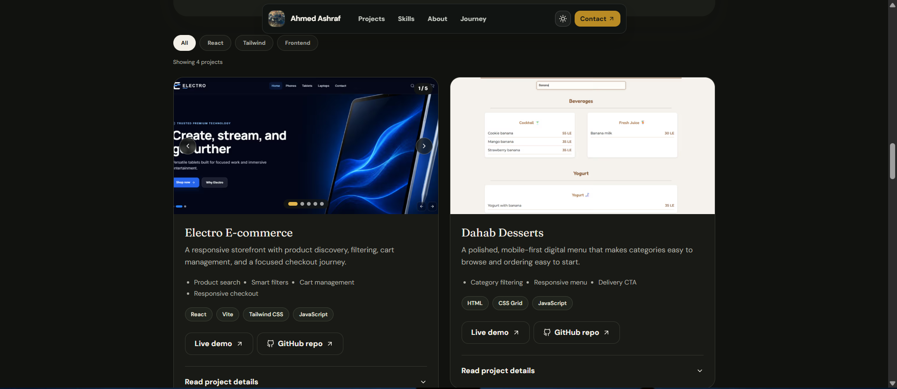

# Ahmed Ashraf — Front-End Developer Portfolio

A responsive portfolio for exploring Ahmed Ashraf's front-end projects, technical capabilities, learning journey, and contact details.

[View the live portfolio](https://ahmed-portfolio-mu-lovat.vercel.app/) · [GitHub](https://github.com/AHM2010) · [LinkedIn](https://www.linkedin.com/in/ahmed-ashraf-491132353/)

## Preview

<p align="center">
  
</p>

| Project showcase | Dark theme |
| --- | --- |
|  |  |

<p align="center">
  
</p>

## Overview

This is Ahmed Ashraf's personal front-end portfolio. It gives recruiters, potential clients, and developers a concise view of his work, skills, background, and availability, with direct access to live projects and source repositories.

The application is a single-page Next.js site built with the App Router. Typed portfolio data is rendered through reusable showcase and project-card components, then enhanced on the client with filters, theme controls, expandable case studies, and accessible image galleries.

## Highlights

- Responsive mobile, tablet, and desktop layouts
- Light and dark themes with saved preference and system-theme fallback
- Filterable projects with live result announcements
- Expandable case studies covering problems, solutions, challenges, and next steps
- Reusable carousel with autoplay, infinite navigation, touch gestures, arrow-key controls, and reduced-motion support
- Sticky adaptive navigation and a mobile menu
- Skip navigation, visible focus states, semantic landmarks, and descriptive image text
- Optimized images, strict TypeScript, and Next.js Core Web Vitals lint rules
- Search and sharing metadata, generated social images, sitemap, robots rules, and a web app manifest

## Live Demo

- [Portfolio](https://ahmed-portfolio-mu-lovat.vercel.app/)
- [Source repository](https://github.com/AHM2010/Ahmed-portfolio)

## Features

### Project discovery

- Flagship Nexora CRM and Atmos Weather Dashboard case studies
- Filtering by React, Tailwind CSS, and general front-end work
- Live project counts for assistive technologies
- Direct links to available demos and repositories
- Expandable context, decisions, lessons, challenges, and planned improvements

### Screenshot galleries

- Shared single-image and multi-image rendering
- Autoplay with previous, next, pagination-dot, and keyboard navigation
- Mouse drag and touch swipe gestures
- Playback pauses during hover, focus, and touch interaction
- Loading placeholders, fade-ins, counters, and screen-reader announcements
- Behavior that respects `prefers-reduced-motion`

### Portfolio experience

- Skills grouped by front-end, UI/UX, and tooling
- Timeline of learning and project milestones
- Contact cards for email, GitHub, LinkedIn, location, and availability
- Theme persistence, mobile navigation, and back-to-top controls
- English content with Arabic and English availability noted

## Featured Work

| Project | Description | Stack | Links |
| --- | --- | --- | --- |
| Nexora CRM | CRM workspace with analytics, customers, deals, tasks, settings, and dark mode. | Next.js, TypeScript, Tailwind CSS, Recharts | [Demo](https://nexora-crm-one.vercel.app/) · [Repository](https://github.com/AHM2010/nexora-crm) |
| Atmos Weather Dashboard | Live conditions, forecasts, analytics, city comparison, a map, Arabic localization, and preferences. | React, TypeScript, Tailwind CSS, weather API, charts | [Demo](https://atmos-weather-dashboard-swart.vercel.app/) · [Repository](https://github.com/AHM2010/atmos-weather-dashboard) |
| Electro E-commerce | Product discovery, filtering, details, cart management, and responsive checkout. | React, Vite, Tailwind CSS, JavaScript | [Demo](https://electro-one.vercel.app/) · [Repository](https://github.com/AHM2010/electro) |
| Dahab Desserts | Mobile-first dessert menu with category filtering, search, and delivery action. | HTML, CSS Grid, JavaScript | [Demo](https://ahm2010.github.io/Dahab-Desserts/) · [Repository](https://github.com/AHM2010/Dahab-Desserts) |
| Task List | Browser task manager with create, complete, delete, and local persistence workflows. | HTML, CSS, JavaScript, Local Storage | [Demo](https://ahm2010.github.io/TO-DO-list-web-app/) · [Repository](https://github.com/AHM2010/TO-DO-list-web-app) |
| Advice Me | Minimal React interface for requesting and displaying advice from a remote API. | React, JavaScript, REST API | [Demo](https://ahm2010.github.io/advice-me/) · [Repository](https://github.com/AHM2010/advice-me) |

## Tech Stack

| Area | Technologies |
| --- | --- |
| Framework | Next.js 15 App Router, React 19 |
| Language | TypeScript 5 in strict mode |
| Styling | Tailwind CSS 4, PostCSS, Autoprefixer |
| Interaction | Framer Motion, React Icons |
| Media | Next.js Image with AVIF and WebP output |
| Fonts | `next/font` with DM Sans and Fraunces |
| Quality | ESLint 9, Next.js Core Web Vitals and TypeScript rules |
| Deployment | Vercel |

The portfolio has no application backend, database, authentication layer, or runtime API integration. Project content is maintained locally in TypeScript.

## Architecture

```text
portfolio/
├── app/                         # Page, metadata, global styles, and metadata routes
├── components/                  # Navigation, showcases, galleries, motion, and shared UI
├── data/
│   └── portfolio.ts             # Projects, filters, skills, timeline, and social links
├── public/
│   ├── logo/                    # Portfolio portrait
│   ├── readme/                  # README preview images
│   └── screenshots/             # Project gallery images
├── types/                       # Shared TypeScript models and declarations
├── next.config.ts               # Build-output and image configuration
├── package.json                 # Dependencies and npm scripts
└── tsconfig.json                # Strict TypeScript configuration
```

The page is primarily server-rendered. Components that need browser state—navigation, filters, theme persistence, expandable details, and galleries—use explicit client boundaries. Project data is separated from presentation so new entries reuse the existing filters, cards, and carousel.

## Getting Started

### Prerequisites

- A current Node.js LTS release
- npm

### Installation

1. Clone the repository:

   ```bash
   git clone https://github.com/AHM2010/Ahmed-portfolio.git
   cd Ahmed-portfolio
   ```

2. Install the locked dependencies:

   ```bash
   npm ci
   ```

3. Optionally create `.env.local` with the site's public URL:

   ```env
   NEXT_PUBLIC_SITE_URL=http://localhost:3000
   ```

4. Start the Turbopack development server:

   ```bash
   npm run dev
   ```

5. Open [http://localhost:3000](http://localhost:3000).

### Production build

```bash
npm run build
npm run start
```

The production server uses port `3000` unless a different port is supplied to Next.js.

## Environment Variables

| Variable | Description | Required |
| --- | --- | --- |
| `NEXT_PUBLIC_SITE_URL` | Absolute public origin used for canonical metadata, Open Graph URLs, the sitemap, and robots metadata. Set it to the deployed HTTPS URL in production. | Recommended locally; required for accurate production metadata |

No secret environment variables are used.

## Available Scripts

| Command | Purpose |
| --- | --- |
| `npm run dev` | Start the Next.js development server with Turbopack. |
| `npm run lint` | Run ESLint and fail on warnings. |
| `npm run build` | Create an optimized production build. |
| `npm run start` | Serve the production build. |

## Updating Portfolio Content

Project entries, filters, skill groups, timeline items, and social links live in `data/portfolio.ts`. Each screenshot uses a public path and meaningful alternative text:

```ts
images: [
  {
    src: "/screenshots/project-dashboard.png",
    alt: "Project analytics dashboard",
  },
];
```

Add the corresponding image to `public/screenshots/`. One image produces a static optimized image; multiple images automatically enable the gallery.

## Performance and Quality

- Next.js image optimization emits AVIF and WebP where supported.
- Priority loading is limited to prominent portfolio and gallery images.
- Fonts are optimized and self-hosted through `next/font`.
- Animations and autoplay are reduced when the user requests reduced motion.
- Client-side JavaScript is scoped to interactive components.
- Semantic HTML, focus treatments, keyboard controls, and live announcements support accessibility.
- Metadata routes provide canonical, Open Graph, Twitter, sitemap, robots, icon, and manifest information.

Run both quality gates before a pull request or deployment:

```bash
npm run lint
npm run build
```

## Future Improvements

- Add automated component, interaction, and accessibility tests
- Publish the downloadable CV currently marked as coming soon
- Add continuous integration for lint and production-build checks
- Measure production Core Web Vitals and address regressions over time

## Contributing

Suggestions and focused improvements are welcome:

1. Fork the repository.
2. Create a branch for the change.
3. Run `npm run lint` and `npm run build`.
4. Open a pull request describing the motivation and result.

## Author

**Ahmed Ashraf** — Front-end developer based in Al Madinah, Saudi Arabia.

- [Portfolio](https://ahmed-portfolio-mu-lovat.vercel.app/)
- [GitHub](https://github.com/AHM2010)
- [LinkedIn](https://www.linkedin.com/in/ahmed-ashraf-491132353/)
- [Email](mailto:ahmed_ashraf2010@yahoo.com)

> This repository does not currently include a license. Its source should not be assumed to be open for reuse or redistribution.
